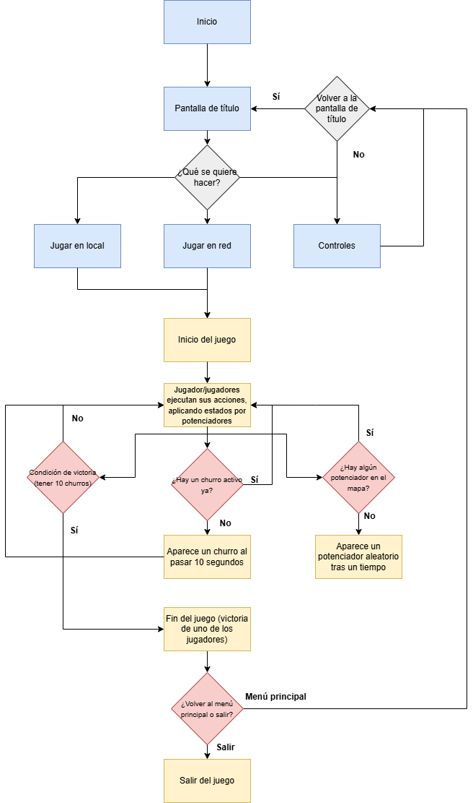

# **INFORMACIÓN GENERAL DEL PROYECTO**

## Nombre del juego
PvP (Pigeon vs Pigeon)
## Nombre del equipo de desarrollo
GB3D
## Descripción de la temática del juego
**PvP (Pigeon vs Pigeon) es un videojuego** 2D multijugador competitivo tanto local como en red en el que dos palomas callejeras luchan por hacerse con la mayor cantidad de churros posible hasta que uno de las dos consiga un número específico para ganar.

Por tanto se trata de un juego de pelea satírica de partidas cortas y entretenidas. La idea del mismo se basa en el popular video *“Dos ratas peleando por un churro con música de fondo de Linkin Park”* facilitado en el siguiente enlace: https://www.youtube.com/watch?v=EhVB22S1Zqk 

## Integrantes del equipo
- Alejandro Marín Sánchez - a.marins.2023@alumnos.urjc.es - Warriorlink
- Miguel Amado Camuñas - m.amado.2023@alumnos.urjc.es - Miguel548
- Hugo Checa Villanueva - h.checa.2023@alumnos.urjc.es - HugoCh05
- Lucas Lorente Herranz - l.lorente.2023@alumnos.urjc.es - Lumi151

# **GDD PvP (Pigeon vs Pigeon)**

# Índice

1. Descripción general
2. Especificaciones básicas
3. Temática
4. Jugabilidad
	- Objetivo
	- Controles
	- Mecánicas
	- Físicas
	- Escenario
5. Imagen y diseño visual
	- Logotipo
	- Uso de colores
	- Aspectos técnicos
	- Estilo visual
	- Inspiración
6. Narrativa
	- Historia
	- Desarrollo de personajes
7. Sonido
	- Música
	- Efectos sonoros
8. Comunicación y marketing
9. Diagrama de flujo del juego
10. Referencias

# **1. Descripción general**
**PvP (Pigeon vs Pigeon)** es un videojuego de plataformas 2D competitivo (PvP, de ahí la analogía con el título del juego) en el que dos jugadores controlan palomas que compiten por recoger churros en un entorno urbano cerca de unos contenedores de basura.  
Se trata de un título ligero y divertido, pensado para partidas rápidas en las que predomine la acción y la rivalidad directa.
Es un juego dirigido a todos los públicos, ya que no hay contenido ofensivo ni violencia explícita. El proyecto se desarrollará para poder ser jugado en un navegador web, tanto en modo local (dos jugadores en un mismo ordenador) como a través de una red privada.  
En su fase final de desarrollo se publicará en plataformas web populares como **Newgrounds o Itch.io**.

# **2. Especificaciones básicas**
- **Género:** Plataformas, acción PvP
- **Modo de juego:** Multijugador competitivo (local y en red)
- **Plataforma:** Web (Itch.io, Newgrounds, etc.)
- **Estilo de juego:** Frenético, exigente, rápido
- **Duración promedio de partida:** 2-5 minutos
- **Público objetivo:** Todos los públicos

# **3. Temática**
El juego es una parodia humorística del famoso video: *“Dos ratas peleando por un churro con música de fondo de Linkin Park”*, reemplazando las ratas por palomas. 
La acción transcurre en una calle urbana llena de basura y obstáculos, donde los jugadores deben recoger churros antes que su rival. 
El tono general será sarcástico y caricaturesco, buscando que la rivalidad entre las palomas resulte absurda y cómica, a la vez que entretenida.

# **4. Jugabilidad**

## **Objetivo del juego**
El objetivo principal del juego es **conseguir más churros que el oponente** antes de que uno de los jugadores alcance la cantidad necesaria (10 churros) para la victoria.  
Durante la partida, los jugadores deberán entorpecer a su rival, utilizando ataques, trampas y potenciadores que cambien el curso de la partida. 

## **Controles**
**Jugador 1:**
	- Moverse: A (izquierda) / D (derecha)
	- Saltar: W
	- Atacar: F
**Jugador 2 (sólo en el caso de que se esté jugando en local, de lo contrario, los controles del segundo jugador serán iguales que los del primero):**
	- Moverse: flecha izquierda / flecha derecha
	- Saltar: flecha arriba
	- Atacar: L

## **Mecánicas**
Cada 10 segundos aparece en un lugar aleatorio, dentro de unos lugares determinados, un churro el cual deben recoger los jugadores.
Los jugadores pueden hacer un ataque básico que, si golpea al contrincante, aturdirá al oponente unos segundos.
También se podrán obtener distintos potenciadores temporales, los cuales aparecerán de manera aleatoria por el escenario de vez en cuando.

**Los potenciadores son:**

*Alpiste:* Al tocarlo, la paloma sufrirá una digestión acelerada, haciendo que el jugador deje una hez en el suelo. Si esta trampa vuelve a ser tocada, aturdirá a quién la active durante unos segundos.

*Pluma dorada:* Cuando un jugador la agarre, incrementará la velocidad de este un 50% durante unos 10 segundos.

*Basura:* cada cierto tiempo (unos 10-15 segundos) aparecerá basura en el entorno de juego que en el momento en el que un jugador interaccione con ella, lo ralentizará a la mitad de su velocidad base durante unos 5 segundos. En caso de que la pluma dorada está activa, la basura desaparece al contacto sin ralentizar al jugador).

## **Físicas**
Las físicas implementadas en el videojuego se basarán en los principios tradicionales utilizados en los juegos de plataformas en 2D. El sistema de movimiento permitirá al jugador desplazarse hacia la derecha e izquierda, además de saltar y caer por la fuerza de la gravedad. 
La velocidad de movimiento será constante, al igual que la fuerza de salto y la de la gravedad, a no ser que uno de los jugadores haya recibido un efecto (positivo o negativo) mencionado anteriormente en el apartado de mecánicas.
Por su parte, las plataformas del escenario tendrán su propia caja de colisiones para evitar que los jugadores las traspasen y puedan estar sobre ellas.

## **Escenario**
El escenario principal será un callejón urbano repleto de contenedores, ventanas, cables, postes y basura acumulada, con un tamaño medio para no hacerlo ni demasiado complejo ni demasiado repetitivo.  
Se busca un diseño que combine verticalidad y horizontalidad, con múltiples niveles de plataformas que fomenten la movilidad y el enfrentamiento constante.  

# **5. Imágen y diseño visual**

## **Logotipo**
Se optó por crear un diseño simple y reconocible para los jugadores

## **Uso de colores**
Se empleará una paleta de colores oscura y con poca saturación, basada en tonos grises, marrones y verdes sucios, para representar el ambiente decadente de un callejón urbano.  
Algunos elementos, como los churros o los potenciadores, tendrán colores más vivos que los hagan resaltar frente al fondo, de forma que el jugador los pueda reconocer con una mayor facilidad.

## **Aspectos técnicos**
El juego será realizado para una visualización en 2D, como ya se ha mencionado con anterioridad. 
La escena de juego contendrá el escenario de juego entero con un encuadre horizontal, estando la cámara siempre estática en la misma posición por simplicidad y facilidad al jugar. Además, los jugadores podrán pasar de un borde al otro de la pantalla (salir del mapa por la izquierda y aparecer por la derecha) para darle más dinamismo al juego.

## **Estilo visual**
El juego combinará el estilo cartoon con el pixel art. Los menús y otras interfaces utilizarán un arte más detallado de tipo cartoon, ya que este estará más enfocado en el marketing y promoción del juego. 
Por otro lado, los sprites y el escenario dentro del propio gameplay utilizará el estilo pixel-art, debido a la facilidad del estilo pixel-art para crear animaciones atractivas.

## **Inspiración**
El proyecto se inspira directamente en el vídeo: *“Dos ratas peleando por un churro con música de fondo de Linkin Park”* y en el modo multijugador **Mario vs Luigi** de *New Super Mario Bros* (Nintendo DS).  
De este último toma la estructura competitiva y la simplicidad de controles, aunque se diferencia por su temática, estética y ritmo de juego más caótico.  
También se busca capturar el humor absurdo del vídeo viral y trasladarlo a una experiencia jugable y entretenida.

# **6. Narrativa**

## **Historia**
En una ciudad cualquiera, durante una noche húmeda y oscura, dos palomas merodean por los callejones en busca de comida.  
El irresistible aroma de unos churros olvidados despierta en ellas un instinto de supervivencia y codicia, y pronto la situación se convierte en una batalla sin cuartel.  
Aunque no hay héroes ni villanos, cada una cree firmemente que ese churro le pertenece por derecho propio. No hay moral, tampoco amistad... solo churros.

## **Desarrollo de personajes**
 -Palomón Johnson: Una paloma muy dura con un pasado oscuro. Formó parte de la mafia aviar y está habituado a los peligros de las calles y las peleas de bandas.
 
 -Dovenando Taubez: Un ave pícara y escurridiza, maestra del sigilo. Lleva toda su vida en las calles, haciendo tratos turbios y trabajos poco deseables. Su filosofía es: *"Todo churro tiene dueño, y ese dueñoñ soy yo".*

Ambos personajes tienen los mismos controles y realizan las mismas acciones, pero se diferencian por su aspecto visual.
# **7. Sonido**

## **Música**
La versión original del videojuego poseerá como tema principal la canción “Numb” del grupo de música “Linkin Park”, ya que es la melodía que se escuchaba en el vídeo original que parodia este juego. 
Sin embargo, para la versión pública del juego se utilizará una canción sin derechos de autor que acompañe al tono urbano, para evitar problemas de derechos y posibles problemas legales.

## **Efectos sonoros**
Se utilizarán sonidos de palomas ululando, agitando las alas y sonidos de comida para los churros. También se usarán efectos de sonido adecuados para cada potenciador.
Al ganar o perder se escuchará un tono diferente en función del resultado de la partida.

# **8. Comunicación y marketing**
La estrategia de comunicación y marketing de **PvP (Pigeon vs Pigeon)** se centrará en resaltar el tono humorístico y competitivo del juego, aprovechando su carácter paródico y su estética llamativa para atraer la atención del público en redes sociales y plataformas de videojuegos independientes.
Como ya se ha mencionado, el juego se publicará en **Newgrounds y en Itch.io** como plataformas principales de distribución del juego.

Eslogan tentativo: *"Dos palamas. Un churro. Ninguna moral ni piedad."*

# **9. Diagrama de flujo del juego**
El diagrama de flujo del juego es el siguiente:

  

1. El juego comienza en el nodo de "Inicio", que lleva directamente a la pantalla de título. En esta pantalla, el jugador puede elegir tres opciones:
- Jugar en local
- Jugar en red
- Controles
Al seleccionar "Controles" se mostrará la información de los botones u acciones del juego, habiendo una opción de volver a la pantalla de título. 
Cualquiera de las otras opciones conduce al inicio de la partida. 
2. 

# **10. Referencias**
[Vídeo original del que se parodia](https://youtu.be/EhVB22S1Zqk?si=W59jPvH9SiqjDxNN)
